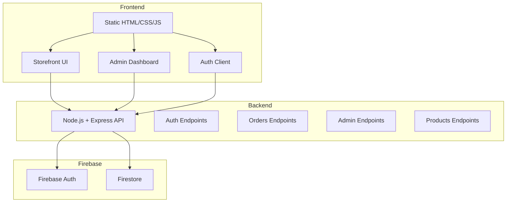

# Canes Grocery - Project Architecture

## Overview
This project is a simple full-stack grocery store built as a static frontend with a Node.js/Express API backed by Firebase (Auth and Firestore).

## System Diagram

## Components

### Frontend
- Static pages in `main/`.
- Core files:
  - `index.html` - storefront.
  - `login.html` - login and registration.
  - `admin.html` - admin dashboard.
  - `account.html` - customer profile.
  - `app.js` - storefront behavior (products, cart, checkout).
  - `auth.js` - API auth client (login/register/session/admin).
  - `style.css`, `style2.css` - shared styling.

### Backend
- Node.js/Express API in `backend/`.
- Core file:
  - `server.js` - routes, Firebase Admin SDK, JWT handling.
- Key endpoint groups:
  - `/api/auth/*` - registration, login, current user.
  - `/api/orders` - customer orders.
  - `/api/admin/*` - admin orders, users, products.
  - `/api/products` - public product list.

### Firebase
- Auth: user accounts and password validation (server uses REST sign-in).
- Firestore: users, orders, products.

## Data Flow

### Login
1. Frontend submits credentials to `/api/auth/login`.
2. Backend validates via Firebase Auth REST and loads user profile from Firestore.
3. Backend issues JWT for session.

### Register
1. Frontend submits registration to `/api/auth/register`.
2. Backend creates Firebase Auth user and writes profile to Firestore.
3. Backend issues JWT for session.

### Products
1. Frontend loads products from `/api/products`.
2. Backend returns Firestore collection, seeding once from `main/products.json` if empty.

### Orders
1. Frontend submits order via `/api/orders`.
2. Backend saves order to Firestore with user info.
3. Admin reads orders via `/api/admin/orders`.

## Configuration
- Backend environment in `backend/.env`:
  - `FIREBASE_PROJECT_ID`
  - `FIREBASE_CLIENT_EMAIL`
  - `FIREBASE_PRIVATE_KEY`
  - `FIREBASE_API_KEY`
  - `JWT_SECRET`

## Notes
- This is a monorepo style layout: `main/` for frontend, `backend/` for API.
- Deployment can be split: static hosting for `main/`, Node.js server for `backend/`.
